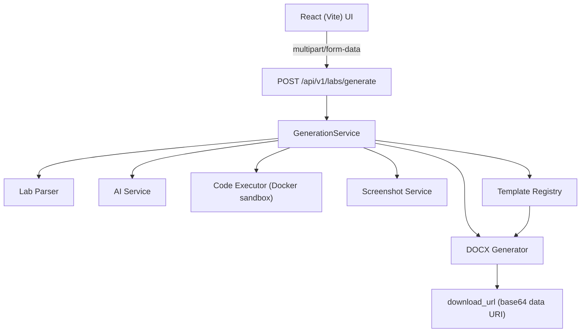

# Labmate AI

Upload a university lab (PDF, DOC, or DOCX). Labmate AI reads it,
generates real code and explanations for each task, actually **runs**
that code in a sandboxed environment, and returns a formatted `.docx`
report — with your university's real branding — containing the
original questions, the generated solutions, and genuine execution
output. Not a mockup of what the code would print: what it actually
printed.

<!-- TODO(Dev A): demo screenshot / GIF of the upload -> generate ->
     download flow goes here. -->

## Why this exists

Writing up a lab report is repetitive: retype the questions, write and
test the code, take a screenshot of the output, paste everything into a
university-branded template. Labmate AI automates all of it except the
one part that should stay human — actually understanding the material.

## How it works

1. **Upload** a lab file and pick your university (Air University,
   Bahria University, or NUST).
2. **AI generates a solution** — objectives, task descriptions, code,
   and a short explanation per task. The AI never claims code was run;
   it only ever describes what the code is intended to do
   (`docs/AI_AND_GENERATION.md`).
3. **Code actually executes**, for real, in a disposable Docker
   sandbox with no network access, strict CPU/memory/process limits,
   and a hard timeout (`docs/CODE_EXECUTION_SECURITY.md`).
4. **Real output gets captured** as a terminal-style screenshot.
5. **A `.docx` report is assembled** from your university's real
   template — logo, layout, every placeholder filled with genuine
   content, never a fabricated one (`docs/DOCX_GENERATION.md`).

If any step can't produce something real — code execution disabled,
Docker unavailable, an unsupported language, a screenshot that failed to
render — the report says so honestly instead of inventing output. See
"Anti-fabrication rule" in `docs/AI_AND_GENERATION.md`.

## Architecture



One backend service, no microservices, no database, no auth — a
deliberately small modular monolith. Full breakdown, folder structure,
and design-pattern rationale in `docs/ARCHITECTURE.md`.

## Tech stack

| Layer | Tech |
|---|---|
| Frontend | React 19 + Vite, TypeScript, Tailwind, shadcn/ui |
| Backend | FastAPI (Python), Pydantic |
| AI | OpenAI-compatible `/chat/completions` API — works with OpenAI itself or a free-tier provider (Groq, Gemini, OpenRouter) via one env var, no code changes (`docs/AI_SERVICE.md`) |
| Code execution | Docker (sandboxed, network-isolated) |
| Screenshots | Playwright (real Chromium, real terminal rendering) |
| Reports | python-docx |
| Testing | pytest + pytest-cov (backend, 97% coverage), Vitest + Playwright (frontend) |

## Running it locally

Two services, run separately.

**Backend** (`localhost:8000`):

```bash
cd backend
pip install -r requirements.txt
cp .env.example .env   # set AI_API_KEY at minimum -- see docs/AI_SERVICE.md
                        # for free-tier options if you don't have an OpenAI key
uvicorn app.main:app --reload
```

Don't have an AI key handy, or just want to try the rest of the pipeline
fast? `python scripts/dev_server_with_fake_ai.py` runs the whole app
with a fixed, fake AI response — every other stage (parsing, execution,
screenshots, template rendering) is completely real.

**Frontend** (`localhost:5173`):

```bash
cd frontend
npm install
npm run dev
```

Then open `http://localhost:5173` — **not** `http://127.0.0.1:5173`; the
backend's CORS config only allows the former by default (a real gotcha
found during integration testing, see `docs/PHASE8_INTEGRATION.md`).

Code execution and screenshots are optional system dependencies (Docker,
Playwright's Chromium) — the app degrades gracefully without either,
returning an honest "not supported"/"no screenshot" result rather than
failing. Full setup for both in `docs/DEPLOYMENT.md`.

## Testing

```bash
cd backend && pytest --cov=app --cov-report=term-missing   # 109 passed, 1 skipped, 97%
cd frontend && npm run lint && npm run build && npx vitest run
cd frontend && npx playwright test   # real browser, real backend
```

Full write-up of what's covered and how (including genuinely unmocked
Playwright screenshot tests) in `docs/PHASE9_TESTING.md`.

## Documentation

| Doc | Covers |
|---|---|
| `docs/PROJECT_SPEC.md` | Original scope and requirements |
| `docs/ARCHITECTURE.md` | Full architecture, folder structure, design patterns |
| `docs/API_CONTRACT.md` | The real `POST /api/v1/labs/generate` request/response shape |
| `docs/AI_AND_GENERATION.md` | The AI pipeline, prompt rules, anti-fabrication design |
| `docs/AI_SERVICE.md` | Configuring an AI provider, incl. free-tier options |
| `docs/CODE_EXECUTION_SECURITY.md` | The Docker sandboxing threat model and controls |
| `docs/Screenshots.md` | Real-output terminal screenshot rendering |
| `docs/TEMPLATE_REGISTRY.md` | University template/logo resolution |
| `docs/DOCX_GENERATION.md` | Final report assembly |
| `docs/PHASE8_INTEGRATION.md` | Frontend-backend wiring, a real CORS gotcha found live |
| `docs/PHASE9_TESTING.md` | Test coverage, what's real vs. mocked, and why |
| `docs/DEPLOYMENT.md` | System dependencies (antiword, Docker, Playwright) |

## Future improvements

- **Real per-step generation progress.** The backend is currently one
  request/response; the frontend estimates progress locally rather than
  the backend streaming real per-stage signals. SSE or polling would be
  the real fix.
- **CI now runs the backend suite on every push** (`.github/workflows/backend-ci.yml`)
  — the frontend equivalent (lint + build + unit + E2E) is a natural
  next addition.
- **Legacy `.doc` support** (via `antiword`) is the only parser with an
  external system dependency, and its real success path has never been
  exercised in any environment this project has been developed in —
  worth deciding if it's worth keeping.
- **Rate limiting** on the code-execution path — each execution is
  individually sandboxed and bounded, but nothing yet throttles how many
  run concurrently.
