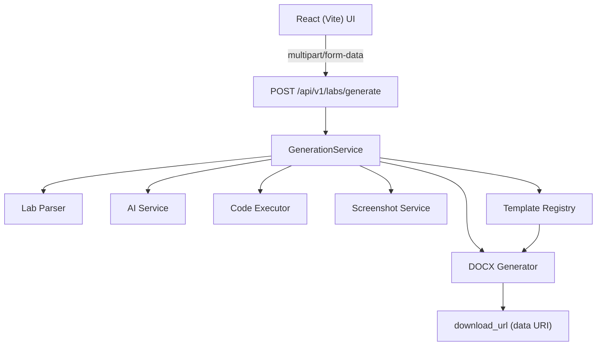

# Architecture

> Originally written pre-implementation, as the plan for a single
> Next.js app, then updated during the migration to a split React
> (Vite) frontend + FastAPI backend (see `MIGRATION_NOTES.md`). This
> version reflects what's actually built as of Phase 9 -- every
> component named below is real, tested code, not a plan.

## Principle

A **modular monolith** -- one backend service, no microservices. The
project stayed intentionally small: no database, no auth, no queues, no
event bus (see "Deliberately not built," below).

## High-level architecture

```text
              React (Vite) UI
                    |
                    v   HTTP (multipart/form-data)
        POST /api/v1/labs/generate
                    |
                    v
           GenerationService
                    |
       +------------+------------+
       v            v            v
   Lab Parser    AI Service   Code Executor
   (Phase 2)     (Phase 3)     (Phase 4)
       |            |            |
       +------------+------------+
                    v
             Screenshot Service
                  (Phase 5)
                    |
                    v
     Template Registry -> DOCX Generator
        (Phase 6)          (Phase 7)
                    |
                    v
     download_url (base64 data: URI --
     see docs/DOCX_GENERATION.md)
```

Every arrow above is one real, direct Python call inside a single
request -- there's no queue, no background worker, no polling. The whole
pipeline runs synchronously (well, `async`ly) inside one
`POST /api/v1/labs/generate` call, coordinated by `GenerationService`.



## Folder structure

```text
frontend/
└── src/
    ├── App.tsx
    ├── components/
    │   ├── ui/
    │   ├── lab-form/          # StudentInfoForm, UniversitySelector, LabFileUpload
    │   └── generation/        # GenerationProgress, ExecutionOutput, ReportPreview
    ├── lib/
    │   └── generate-api.ts    # the real fetch() to the backend
    └── types/

backend/
├── app/
│   ├── main.py                 # FastAPI app, CORS, exception handlers
│   ├── routes/
│   │   ├── health.py
│   │   └── lab.py
│   ├── schemas/                 # Pydantic models -- the real wire contract
│   │   ├── student.py
│   │   ├── generate.py
│   │   ├── lab.py
│   │   └── template.py
│   ├── services/
│   │   └── generation_service.py   # orchestrates every phase below
│   ├── validation/
│   │   └── lab_file.py
│   ├── core/
│   │   ├── config.py            # Settings, incl. AI_BASE_URL for free-tier providers
│   │   └── errors.py            # AppError + the catch-all "never leak details" handler
│   ├── domain/
│   │   └── university.py
│   ├── parsing/                 # Phase 2 -- PdfParser / DocxParser / DocParser
│   ├── ai/                      # Phase 3 -- AIProvider protocol, OpenAIProvider, prompts
│   ├── execution/               # Phase 4 -- CodeExecutor strategies, Docker sandboxing
│   ├── screenshots/              # Phase 5 -- real Playwright terminal screenshots
│   ├── templates_registry/       # Phase 6 -- resolves University -> template + logo
│   └── documents/                # Phase 7 -- DocxGenerator, fills every placeholder
├── templates_registry/
│   └── templates/
│       ├── air/{template.docx, logo.png}
│       ├── bahria/{template.docx, logo.png}
│       └── nust/{template.docx, logo.png}
├── scripts/
│   └── dev_server_with_fake_ai.py   # real app, fake AI step -- fast local/E2E dev server
└── tests/                        # 109 tests, 97% coverage (docs/PHASE9_TESTING.md)
```

## Design patterns actually used

Only where they solved a real problem -- nothing added for its own sake.

### Service Layer

`GenerationService` coordinates the complete pipeline end to end. Every
route stays thin: routing, request validation, and error translation
only -- no business logic.

### Strategy Pattern

```text
CodeExecutor (Protocol)
├── PythonExecutor      -- real, Docker-sandboxed (docs/CODE_EXECUTION_SECURITY.md)
└── UnsupportedExecutor -- any other language; also the fallback if Docker
                           itself isn't installed/enabled
```

`get_executor(language)` dispatches to whichever strategy applies. Only
Python is actually implemented -- C++/Java were part of the original
plan's `CodeExecutor` sketch but were never built; any non-Python task
gets a real, honest `UNSUPPORTED` result rather than a fabricated one.

### Adapter Pattern

```python
class AIProvider(Protocol):
    async def generate_solutions(self, parsed_lab: ParsedLab) -> GeneratedLab: ...
```

`OpenAIProvider` is the only real implementation, but it's a thin
adapter over the `openai` SDK's `AsyncOpenAI` client -- and since that
SDK talks to any OpenAI-compatible `/chat/completions` endpoint, the
same adapter also works against free-tier providers (Groq, Gemini,
OpenRouter) via `AI_BASE_URL`, with no code changes (`docs/AI_SERVICE.md`).
`FakeAIProvider` (`tests/ai_fakes.py`) is a second, test/dev-only
implementation used throughout the test suite and by
`scripts/dev_server_with_fake_ai.py`.

### Template Registry

```python
class University(str, Enum):
    AIR = "air"
    BAHRIA = "bahria"
    NUST = "nust"
```

`TemplateRegistry.get_template(university)` resolves a `University` to
its on-disk `template.docx` + `logo.png`, verifying both exist before
returning (`docs/TEMPLATE_REGISTRY.md`). Adding a university is adding a
template/logo pair on disk plus one enum value -- nothing else in the
pipeline changes.

## The separation the AI is and isn't allowed to make

AI decides:

> What should be in the report? (objectives, task descriptions, code,
> explanations, conclusion)

Application code decides:

> How should the report look, and what actually happened when the code
> ran?

So: the AI (`app/ai/prompts.py`'s system prompt) is explicitly forbidden
from claiming code was executed or fabricating output -- it only ever
writes code and an explanation. Real execution (`app/execution/`) and
real output capture (`app/screenshots/`) are separate, deterministic
steps the AI has no involvement in and no ability to influence. The AI
never touches DOCX formatting either -- `DocxGenerator` (Phase 7) owns
that entirely, filling a fixed template.

```text
AI
 |  (objectives, task descriptions, code, explanations -- content only)
 v
GeneratedLab (Pydantic-validated structured content)
 |
 v
Real code execution + real screenshot capture
 |  (independent of the AI; can fail/degrade without failing the request)
 v
DocxGenerator + University template
 |
 v
Downloadable .docx
```

## Deliberately not built

Per the original scope decision, still honored:

- No database, no auth, no Redis, no queues, no event bus, no
  microservices, no agent framework.
- No per-request persistence at all -- `download_url` is a base64 data
  URI (`docs/DOCX_GENERATION.md`), not a file saved anywhere server-side.
- No real-time progress channel (SSE/WebSocket) -- one request, one
  response; the frontend estimates progress locally rather than the
  backend streaming it.

A clean modular monolith was enough for what this project actually
needed.
